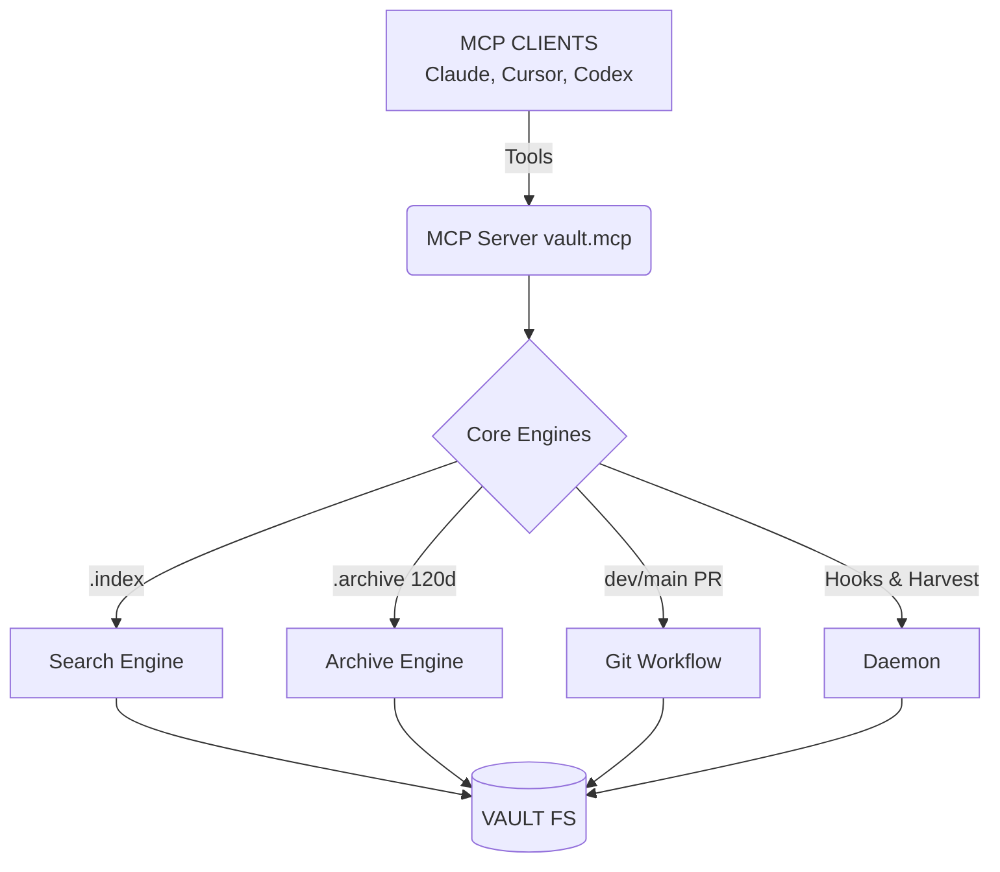
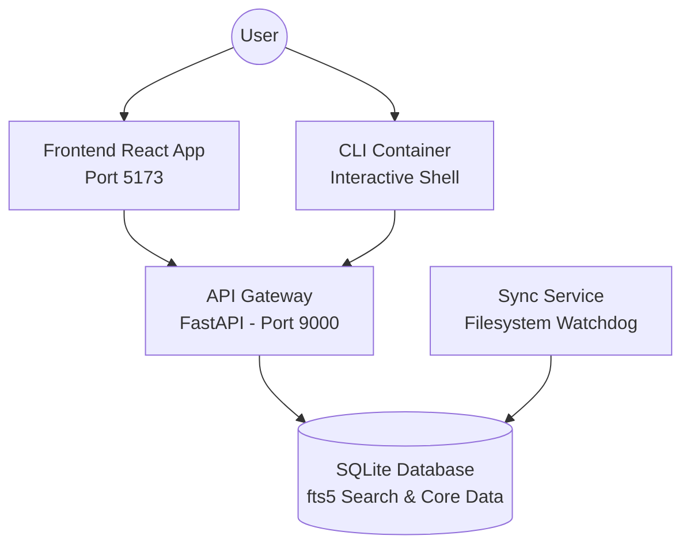

# Global Memory Context
Pulled from Central Brain: `CentralBrain`

## Projects

### README.md
---
created: 2026-07-18T18:56:34.565405+00:00
id: 74780c0211a7
modified: 2026-07-18T18:56:34.565405+00:00
source: daemon
status: active
tags:
  - readme
type: overview
---

# 🎯 Skill Arbitrage Radar

**Project:** `skill-arbitrage-radar`

**Path:** `skill-arbitrage-radar`

**Description:** A data-driven platform designed to identify high-demand, low-supply skill combinations across freelance marketplaces and job boards. By pinpointing skill arbitrage opportunities, users can strategically target lucrative niches, optimize their portfolios, and streamline their outreach efforts.

## README

# 🎯 Skill Arbitrage Radar

A data-driven platform designed to identify high-demand, low-supply skill combinations across freelance marketplaces and job boards. By pinpointing skill arbitrage opportunities, users can strategically target lucrative niches, optimize their portfolios, and streamline their outreach efforts.

## ✨ Features

- **🔍 Market Scraper**: Automated gathering of job and freelance data from multiple marketplaces.
- **📈 Arbitrage Engine**: Analyzes supply and demand to identify high-value skill combinations.
- **📁 Portfolio Management**: Manage and tailor portfolios specifically to highlight in-demand skills.
- **🚀 Outreach Automation**: Tools to automate client outreach and proposal generation.
- **💰 Income Tracking**: Monitor and forecast income based on executed arbitrage opportunities.

## 🛠️ Technology Stack

- **Frontend**: React (Vite), TypeScript
- **Backend API**: Node.js, TypeScript
- **Database**: MySQL
- **Authentication**: GitHub OAuth

## 🚀 Getting Started

### Prerequisites

- Node.js (v18+)
- MySQL
- A GitHub OAuth App (for authentication)

### Setup Instructions

1. **Clone the repository:**
   ```bash
   git clone <repo-url>
   cd skill-arbitrage-radar
   ```

2. **Environment Variables:**
   Copy the example environment file and configure it with your credentials:
   ```bash
   cp .env.example .env
   ```
   Fill in your MySQL connection string and GitHub OAuth keys in `.env`.

3. **Install Dependencies:**
   Ensure you install dependencies for both the frontend and backend.
   ```bash
   npm install
   ```

4. **Run the Application:**
   Start the development server:
   ```bash
   npm run dev
   ```

## 🤝 Contributing

All active development is done on the `dev` branch. Please ensure you checkout `dev` and submit pull requests against it.


---

### tech-stack.md
---
created: 2026-07-18T18:56:34.565801+00:00
id: b37bf75ace20
modified: 2026-07-18T18:56:34.565801+00:00
source: daemon
status: active
tags:
  - dependencies
type: tech-stack
---

# Tech Stack: skill-arbitrage-radar

**Runtime:** Node.js

**Dependencies:** @base-ui/react, @fontsource-variable/geist, @hono/node-server, @tanstack/react-query, @trpc/client, @trpc/react-query, @trpc/server, cheerio, class-variance-authority, clsx


---

### health.md
---
created: 2026-07-18T18:56:34.584719+00:00
id: 9d23f5841ecd
modified: 2026-07-18T18:56:34.584719+00:00
source: daemon
status: active
tags:
  - health
type: health
---

# Health Check: skill-arbitrage-radar

**Issues:**

- ⚠️ No test directory found
- ⚠️ No LICENSE file


---

### structure.md
---
created: 2026-07-18T18:56:34.566366+00:00
id: 5227c7a2334b
modified: 2026-07-18T18:56:34.566366+00:00
source: daemon
status: active
tags:
  - source
type: structure
---

# Source Structure: skill-arbitrage-radar

**Root:** `src`

```
./
  App.tsx
  index.css
  main.tsx
  vite-env.d.ts
  pages/
    Dashboard.tsx
    ExecutionBoard.tsx
    Home.tsx
    IncomeTracker.tsx
    Login.tsx
    NotFound.tsx
    OpportunityDetail.tsx
    ProfilePage.tsx
  lib/
    utils.ts
  hooks/
    useAuth.ts
  providers/
    trpc.tsx
  components/
    layout.tsx
    components/ui/
      badge.tsx
      button.tsx
      card.tsx
      dialog.tsx
      input.tsx
      select.tsx
      skeleton.tsx
      tabs.tsx
      textarea.tsx
```


---

### todos.md
---
created: 2026-07-18T18:56:34.581492+00:00
id: ddf9b211b6c6
modified: 2026-07-18T18:56:34.581492+00:00
source: daemon
status: active
tags:
  - todos
type: todos
---

# Open Items: skill-arbitrage-radar

- **[HACK]** er News post — `docs/MARKETING.md`
- **[HACK]** er News, IndieHackers — `docs/MARKETING.md`
- **[BUG]** ging..."); — `api/lib/scraper/upwork.ts`
- **[BUG]** .png" }); — `api/lib/scraper/upwork.ts`
- **[BUG]** .png"); — `api/lib/scraper/upwork.ts`


---

### README.md
---
created: 2026-07-18T20:00:44.929407+00:00
id: ae594251e45c
modified: 2026-07-18T20:00:44.929407+00:00
source: daemon
status: active
tags:
  - readme
type: overview
---

# ⚡ AgentOS

**Project:** `AgentOS`

**Path:** `AgentOS`

**Description:** > A production-grade autonomous agent platform featuring verifiable trust ledgers, strict budget constraints, and a stunning command dashboard.

## README

# ⚡ AgentOS

> A production-grade autonomous agent platform featuring verifiable trust ledgers, strict budget constraints, and a stunning command dashboard.

**AgentOS** is a modern, production-grade operating system designed to manage, orchestrate, and monitor autonomous AI agents at scale. Built with security and transparency in mind, it provides the robust infrastructure needed to take LLM-powered agents from experimental scripts to enterprise-ready deployments.

Rather than letting agents run wild, AgentOS enforces strict operational boundaries. It tracks every decision an agent makes, maintains a cryptographic-style trust ledger of agent success rates, and enforces hard budgetary constraints—ensuring that your autonomous workforce is always verifiable, cost-effective, and aligned with your standing goals.

---

## ✨ Key Features

* 🛡️ **Verifiable Trust Ledger:** Monitors individual agent skills and calculates historical pass/fail rates so you know exactly which AI capabilities are reliable for production.
* 💰 **Strict Budget Enforcement:** Native cost-tracking that instantly pauses runaway agents the moment they hit your predefined daily API budget.
* 🎯 **Standing Goal Verification:** Define strict invariants and operational goals. The system continuously audits agents against these predicates to ensure total alignment.
* 📊 **Stunning Command Center:** A beautiful, dark-mode glassmorphic Next.js dashboard providing real-time telemetry into agent run timelines, active budgets, and system health.
* 🚀 **Async & Scalable:** Powered by a high-performance FastAPI/Uvicorn backend, Async PostgreSQL (`asyncpg`), and Redis for lightning-fast orchestration. 

---

## 🛠️ Technology Stack

**Frontend Command Center:**
* Next.js 14 (App Router)
* React & Tailwind CSS
* Radix UI & Recharts
* Glassmorphic Dark Mode UI

**Backend Orchestration:**
* Python & FastAPI
* Uvicorn (Async ASGI server)
* SQLAlchemy (with `asyncpg`) & Alembic (Migrations)
* Redis (State management and caching)
* Pytest (Testing suite)

**Infrastructure:**
* Fully Dockerized (multi-container environment)
* Automated Makefile workflows

---

## 🚀 Getting Started

### Prerequisites
Make sure you have the following installed on your machine:
* [Docker](https://docs.docker.com/get-docker/)
* [Docker Compose](https://docs.docker.com/compose/install/)
* `make` (Usually pre-installed on Linux/macOS)

### 1. One-Line Installation (Recommended)
The fastest way to install AgentOS, set up the CLI, and spin up the Docker containers is by running our automated installer in your terminal:

```bash
curl -sSf https://raw.githubusercontent.com/pisigmac/AgentOS/main/install.sh | bash
```

Once completed, simply run `source ~/.bashrc` to activate the `agent` CLI command globally.

### 2. Manual Installation
If you prefer to install manually:
```bash
git clone https://github.com/pisigmac/AgentOS.git
cd AgentOS
./scripts/start_all.sh
```
Once the startup script finishes successfully, the services will be running on unique, non-conflicting ports.
Open your web browser and navigate to:
* **Frontend Dashboard:** [http://localhost:13000](http://localhost:13000)
* **Backend API Documentation:** [http://localhost:18000/docs](http://localhost:18000/docs)

### 3. Shutting Down
To gracefully stop all services, tear down the containers, and clean up the environment, run:
```bash
./stop_all.sh
```

---

## 💻 Makefile Commands
If you prefer running individual commands manually instead of using `start_all.sh`, the project includes a comprehensive `Makefile`:

* `make up` - Spin up all Docker containers in the background.
* `make down` - Stop and remove all containers.
* `make test` - Run the backend Pytest suite within the Docker container.
* `make lint` - Run `flake8` and `black` on the backend codebase.
* `make migrate msg="your message"` - Autogenerate Alembic database migrations.
* `make seed` - Seed the database with initial dashboard data.
* `make health` - Ping the backend health check endpoint.
* `make logs` - View the live output of the backend logs.

---

## 🤝 Contributing
Contributions are always welcome! Feel free to open an issue or submit a Pull Request if you have ideas on how to improve the operating system.


---

### tech-stack.md
---
created: 2026-07-18T20:00:44.930172+00:00
id: 5e957f912797
modified: 2026-07-18T20:00:44.930172+00:00
source: daemon
status: active
tags:
  - dependencies
type: tech-stack
---

# Tech Stack: AgentOS

**Runtime:** Python


---

### health.md
---
created: 2026-07-18T20:00:44.944391+00:00
id: f053d71ee530
modified: 2026-07-18T20:00:44.944391+00:00
source: daemon
status: active
tags:
  - health
type: health
---

# Health Check: AgentOS

**Issues:**

- ⚠️ 4 uncommitted file(s)
- ⚠️ No test directory found
- ⚠️ No LICENSE file


---

### structure.md
---
created: 2026-07-18T20:00:44.931471+00:00
id: cd9c39d5edd3
modified: 2026-07-18T20:00:44.931471+00:00
source: daemon
status: active
tags:
  - source
type: structure
---

# Source Structure: AgentOS

**Root:** `.`

```
./
  AGENTS.md
  Future_improvements.md
  Makefile
  README.md
  docker-compose.yml
  install.sh
  frontend/
    Dockerfile
    package.json
    postcss.config.js
    tailwind.config.ts
    tsconfig.json
    frontend/tests/
    frontend/src/
  cli/
    agent.py
    requirements.txt
  docs/
    01-features.md
    02-claude.md
    03-agents.md
    04-api.md
    05-openapi.md
    06-marketing.md
    07-social.md
    08-codemap.md
    09-future-plan.md
    10-tests.md
    11-architecture.md
    12-tech-stack.md
    13-env.md
    14-deploy.md
    15-db-schema.md
    16-pricing.md
    17-analytics.md
    18-errors.md
    19-changelog.md
    20-ops.md
  backend/
    Dockerfile
    alembic.ini
    models.yaml
    pyproject.toml
    requirements.txt
    backend/alembic/
      env.py
    backend/app/
      config.py
      database.py
      main.py
      models.py
      schemas.py
  scripts/
    health-check.sh
    seed.sh
    setup.sh
    start_all.sh
    stop_all.sh
  ops/
    data-retention.md
    email.md
    empty-states.md
    events.md
    feature-flags.md
    monitoring.md
    payments.md
    perf-budget.md
    rate-limits.md
    staging.md
```


---

### todos.md
---
created: 2026-07-18T20:00:44.940222+00:00
id: 4b0407857909
modified: 2026-07-18T20:00:44.940222+00:00
source: daemon
status: active
tags:
  - todos
type: todos
---

# Open Items: AgentOS

- **[TODO]** s. npm test -- tests/auth | grep passing runs daily forever. The first time it catches a silent regression, you'll never go back. — `docs/07-social.md`
- **[BUG]** fix doesn't need surrounding cleanup. Don't design for hypothetical future requirements: do the simplest thing that works well. Don't add error handling or validation for scenarios that cannot happen. — `backend/app/core/worker.py`
- **[BUG]** ) — `ops/staging.md`


---

### README.md
---
created: 2026-07-18T19:51:10.940917+00:00
id: f7511c7f7d06
modified: 2026-07-18T19:51:10.940917+00:00
source: daemon
status: active
tags:
  - readme
type: overview
---

# 🎯 Skill Arbitrage Radar

**Project:** `SkillEdge`

**Path:** `SkillEdge`

**Description:** A data-driven platform designed to identify high-demand, low-supply skill combinations across freelance marketplaces and job boards. By pinpointing skill arbitrage opportunities, users can strategically target lucrative niches, optimize their portfolios, and streamline their outreach efforts.

## README

# 🎯 Skill Arbitrage Radar

A data-driven platform designed to identify high-demand, low-supply skill combinations across freelance marketplaces and job boards. By pinpointing skill arbitrage opportunities, users can strategically target lucrative niches, optimize their portfolios, and streamline their outreach efforts.

## ✨ Features

- **🔍 Market Scraper**: Automated gathering of job and freelance data from multiple marketplaces.
- **📈 Arbitrage Engine**: Analyzes supply and demand to identify high-value skill combinations.
- **📁 Portfolio Management**: Manage and tailor portfolios specifically to highlight in-demand skills.
- **🚀 Outreach Automation**: Tools to automate client outreach and proposal generation.
- **💰 Income Tracking**: Monitor and forecast income based on executed arbitrage opportunities.

## 🛠️ Technology Stack

- **Frontend**: React (Vite), TypeScript
- **Backend API**: Node.js, TypeScript
- **Database**: MySQL
- **Authentication**: GitHub OAuth

## 🚀 Getting Started

### Prerequisites

- Node.js (v18+)
- MySQL
- A GitHub OAuth App (for authentication)

### Setup Instructions

1. **Clone the repository:**
   ```bash
   git clone <repo-url>
   cd skill-arbitrage-radar
   ```

2. **Environment Variables:**
   Copy the example environment file and configure it with your credentials:
   ```bash
   cp .env.example .env
   ```
   Fill in your MySQL connection string and GitHub OAuth keys in `.env`.

3. **Install Dependencies:**
   Ensure you install dependencies for both the frontend and backend.
   ```bash
   npm install
   ```

4. **Run the Application:**
   Start the development server:
   ```bash
   npm run dev
   ```

## 🤝 Contributing

All active development is done on the `dev` branch. Please ensure you checkout `dev` and submit pull requests against it.


---

### tech-stack.md
---
created: 2026-07-18T19:51:10.941273+00:00
id: 2caba6a5c06b
modified: 2026-07-18T19:51:10.941273+00:00
source: daemon
status: active
tags:
  - dependencies
type: tech-stack
---

# Tech Stack: SkillEdge

**Runtime:** Node.js

**Dependencies:** @base-ui/react, @fontsource-variable/geist, @hono/node-server, @tanstack/react-query, @trpc/client, @trpc/react-query, @trpc/server, cheerio, class-variance-authority, clsx


---

### health.md
---
created: 2026-07-18T19:51:10.958673+00:00
id: 366b8327a722
modified: 2026-07-18T19:51:10.958673+00:00
source: daemon
status: active
tags:
  - health
type: health
---

# Health Check: SkillEdge

**Issues:**

- ⚠️ No test directory found
- ⚠️ No LICENSE file


---

### structure.md
---
created: 2026-07-18T19:51:10.941960+00:00
id: 9ccdb30ffbbe
modified: 2026-07-18T19:51:10.941960+00:00
source: daemon
status: active
tags:
  - source
type: structure
---

# Source Structure: SkillEdge

**Root:** `src`

```
./
  App.tsx
  index.css
  main.tsx
  vite-env.d.ts
  pages/
    Dashboard.tsx
    ExecutionBoard.tsx
    Home.tsx
    IncomeTracker.tsx
    Login.tsx
    NotFound.tsx
    OpportunityDetail.tsx
    ProfilePage.tsx
  lib/
    utils.ts
  hooks/
    useAuth.ts
  providers/
    trpc.tsx
  components/
    layout.tsx
    components/ui/
      badge.tsx
      button.tsx
      card.tsx
      dialog.tsx
      input.tsx
      select.tsx
      skeleton.tsx
      tabs.tsx
      textarea.tsx
```


---

### todos.md
---
created: 2026-07-18T19:51:10.953754+00:00
id: ed61c9d16a32
modified: 2026-07-18T19:51:10.953754+00:00
source: daemon
status: active
tags:
  - todos
type: todos
---

# Open Items: SkillEdge

- **[HACK]** er News post — `docs/MARKETING.md`
- **[HACK]** er News, IndieHackers — `docs/MARKETING.md`
- **[BUG]** ging..."); — `api/lib/scraper/upwork.ts`
- **[BUG]** .png" }); — `api/lib/scraper/upwork.ts`
- **[BUG]** .png"); — `api/lib/scraper/upwork.ts`


---

### README.md
---
created: 2026-07-18T20:00:16.459143+00:00
id: e9db0fc7621b
modified: 2026-07-18T20:00:16.459143+00:00
source: daemon
status: active
tags:
  - readme
type: overview
---

# 1. Install the CLI globally

**Project:** `AgentDrive`

**Path:** `AgentDrive`

**Description:** [](https://github.com/pisigmac/AgentDrive/actions)
[](https://opensource.org/licenses/MIT)
[](https://github.com/pisigmac/AgentDrive/actions)
[](https://opensource.org/licenses/MIT)
[](https://www.python.org/downloads/)
[](https://github.com/psf/black)

<h1>
  <picture>
    
  </picture>
  <br/>
  AgentDrive
</h1>

<h3>Give your AI Agents a Git-Native, Infinite Memory Drive.</h3>

<p>
Say goodbye to black-box vector databases and locked-in memory platforms.<br/>
<b>AgentDrive</b> turns your local filesystem into a highly structured, self-updating,<br/>
markdown-based memory system for Claude, Cursor, and OpenAI.
</p>

</div>

---

### 🧠 The Next Evolution of Agent Context

└ **Git-Native Memory** — All agent writes go to `dev`, keeping `main` perfectly stable.<br>
└ **Central Brain Architecture** — Link endless repositories to a single, global memory vault.<br>
└ **Auto-Harvesting Daemon** — Background processes automatically summarize code changes into context.<br>
└ **Offline-First MCP Server** — Works locally without relying on cloud embeddings.<br>
└ **Built-in Auto-Archive** — Self-maintaining vault that archives stale contexts after 120 days.<br>
└ **Strict Governance** — Enforces root `AGENTS.md` rules for every autonomous action.<br>

<br>
<hr style="border: 0; height: 1px; background-image: linear-gradient(to right, rgba(0, 0, 0, 0), rgba(0, 0, 0, 0.25), rgba(0, 0, 0, 0));" />
<br>

### 🚀 Quick Start

One command to initialize AgentDrive globally:

```bash
curl -sSL https://raw.githubusercontent.com/pisigmac/agentdrive/main/setup.sh | bash
```

Or manually:

```bash
# 1. Install the CLI globally
git clone https://github.com/pisigmac/agentdrive.git
cd agentdrive
pip install -e .

# 2. Go to your own project and initialize a vault
cd ~/my-project
vault init
```

<br>
<hr style="border: 0; height: 1px; background-image: linear-gradient(to right, rgba(0, 0, 0, 0), rgba(0, 0, 0, 0.25), rgba(0, 0, 0, 0));" />
<br>

### 🌐 The Central Brain Architecture (Multi-Repo)

If you have multiple projects and don't want to clutter them with `.vault/` folders, you can use the Central Brain architecture.

1. **Create the Brain:** Pick a central folder (e.g., `~/AgentDriveBrain`) and run `vault init`.
2. **Activate the Brain:** Tell AgentDrive this is your primary brain by running `vault brain ~/AgentDriveBrain`.
3. **Link your Projects:** Navigate to any pure code repository and simply run `vault link`. It will automatically link to your active brain!

This drops a tiny `AGENTS.md` redirect file in your codebase that instructs AI agents to read context from the Central Brain. Every time you push or commit, the local daemon wakes up and routes all the generated context directly into your Brain repository!

<br>
<hr style="border: 0; height: 1px; background-image: linear-gradient(to right, rgba(0, 0, 0, 0), rgba(0, 0, 0, 0.25), rgba(0, 0, 0, 0));" />
<br>

### 📁 What You Get

A beautifully structured, self-governing memory filesystem out-of-the-box.

```text
vault/
├── AGENTS.md                 # Root governance (all providers read this)
├── projects/                 # Active work
├── people/                   # Contacts (never archived)
├── meetings/                 # Meeting notes
├── decisions/                # Architecture decisions
├── goals/                    # OKRs and objectives
├── resources/                # Bookmarks, articles
├── experiments/              # Ephemeral prototypes
├── threads/                  # Conversation histories
├── reviews/                  # Retrospectives
├── templates/                # Markdown templates
├── .vault/
│   ├── skills/               # Executable agent skills
│   ├── registry/             # Capability registry
│   ├── staging/              # Pending writes (dev branch)
│   ├── archive/              # Hidden — 120-day+ files
│   ├── index/                # Search indices
│   └── schemas/              # Validation schemas
└── .github/workflows/
    └── auto-archive.yml      # Weekly maintenance
```

<br>
<hr style="border: 0; height: 1px; background-image: linear-gradient(to right, rgba(0, 0, 0, 0), rgba(0, 0, 0, 0.25), rgba(0, 0, 0, 0));" />
<br>

### 🏗️ Architecture Flow

<div align="center">
  <code>User Prompt</code> → <code>Agent writes via MCP</code> → <code>Staged to 'dev' branch</code> → <code>Nightly PR raised</code> → <code>Human merges to 'main'</code>
</div>

<br>



<br>
<hr style="border: 0; height: 1px; background-image: linear-gradient(to right, rgba(0, 0, 0, 0), rgba(0, 0, 0, 0.25), rgba(0, 0, 0, 0));" />
<br>

### 🛠️ CLI Commands

```bash
# Initialize
vault init                       # Create new vault in current directory
vault init ~/my-vault            # Custom path

# Status & Health
vault status                     # Git + health overview
vault health --report            # Full diagnostic report

# Search
vault search "kubernetes"        # Keyword search
vault search "design" --semantic # Semantic rerank

# Archive
vault archive                    # Archive stale files
vault archive --dry-run          # Preview only

# Registry
vault registry --list            # All skills

# MCP
vault mcp --install              # Auto-configure Claude/Cursor
vault mcp --run                  # Start stdio server
```

<br>
<hr style="border: 0; height: 1px; background-image: linear-gradient(to right, rgba(0, 0, 0, 0), rgba(0, 0, 0, 0.25), rgba(0, 0, 0, 0));" />
<br>

### 📜 AGENTS.md Governance

Every vault has a root `AGENTS.md` that **ALL** AI providers must read before acting. It strictly defines:

1. **Branch Rule** — All writes go to `dev`, never `main`
2. **Approval Gate** — Stage to `.vault/staging/`, raise PR
3. **Schema Rule** — Every file needs frontmatter
4. **Archive Rule** — Old files move to `.vault/archive/`
5. **Source Tag** — Mark who wrote each file
6. **No Secrets** — Never store tokens in vault files
7. **Cross-Reference** — Use `[[WikiLinks]]` between entries

<br>
<hr style="border: 0; height: 1px; background-image: linear-gradient(to right, rgba(0, 0, 0, 0), rgba(0, 0, 0, 0.25), rgba(0, 0, 0, 0));" />
<br>

<div align="center">
  <p>Built for the autonomous future. Licensed under <b>MIT</b>.</p>
</div>


---

### tech-stack.md
---
created: 2026-07-18T20:00:16.459879+00:00
id: b79326211332
modified: 2026-07-18T20:00:16.459879+00:00
source: daemon
status: active
tags:
  - dependencies
type: tech-stack
---

# Tech Stack: AgentDrive

**Runtime:** Python

**Dependencies:** 
    "click>=8.0",
    "pyyaml>=6.0",
    "schedule>=1.2",
    "rich>=13.0",
    "gitpython>=3.1",
    "pydantic>=2.0",
    "sentence-transformers>=2.2",
    "numpy>=1.24",


---

### health.md
---
created: 2026-07-18T20:00:16.476174+00:00
id: cd49546f137e
modified: 2026-07-18T20:00:16.476174+00:00
source: daemon
status: active
tags:
  - health
type: health
---

# Health Check: AgentDrive

**Issues:**

- ⚠️ 1 uncommitted file(s)


---

### structure.md
---
created: 2026-07-18T20:00:16.460972+00:00
id: d532249a6010
modified: 2026-07-18T20:00:16.460972+00:00
source: daemon
status: active
tags:
  - source
type: structure
---

# Source Structure: AgentDrive

**Root:** `vault`

```
./
  __init__.py
  cli/
    __init__.py
    main.py
  templates/
    templates/github/
      auto-pr.yml
  core/
    __init__.py
    archive.py
    config.py
    daemon.py
    git_workflow.py
    health.py
    registry.py
    scheduler.py
    search.py
  mcp/
    __init__.py
    server.py
```


---

### todos.md
---
created: 2026-07-18T20:00:16.473396+00:00
id: 3121f5cbd2b0
modified: 2026-07-18T20:00:16.473396+00:00
source: daemon
status: active
tags:
  - todos
type: todos
---

# Open Items: AgentDrive

- **[TODO]** _count\']} |\n"', 'md += f"| **{p[\'name\']}** | {p[\'status\']} | {tech_str} | {health_icon} {p[\'health\']} | {p[\'recent_commits\']} | {p[\'todo_count\']} |\\n"') — `fix_syntax.py`
- **[TODO]** _count\']} TODOs/FIXMEs\n"', 'md += f"- **Open items:** {p[\'todo_count\']} TODOs/FIXMEs\\n"') — `fix_syntax.py`
- **[TODO]** [\'kind\']}]** {todo[\'desc\']} — *{todo[\'project\']}*\n"', 'md += f"- **[{todo[\'kind\']}]** {todo[\'desc\']} — *{todo[\'project\']}*\\n"') — `fix_syntax.py`
- **[TODO]** s) - 20} more_\n"', 'md += f"\\n_... and {len(all_todos) - 20} more_\\n"') — `fix_syntax.py`
- **[TODO]** s, and tech stack. — `docs/central_brain_architecture.md`
- **[TODO]** s() — `vault/core/daemon.py`
- **[TODO]** s(self) -> int: — `vault/core/daemon.py`
- **[TODO]** s = [] — `vault/core/daemon.py`
- **[TODO]** |FIXME|HACK|BUG|XXX)[\s:]*(.*?)$", — `vault/core/daemon.py`
- **[TODO]** s.append((kind, desc, rel)) — `vault/core/daemon.py`
- **[TODO]** s: — `vault/core/daemon.py`
- **[TODO]** s[:50]: — `vault/core/daemon.py`
- **[TODO]** s) > 50: — `vault/core/daemon.py`
- **[TODO]** s) - 50} more_\n" — `vault/core/daemon.py`
- **[TODO]** s.md" — `vault/core/daemon.py`
- **[TODO]** s", ["todos"], body), — `vault/core/daemon.py`
- **[TODO]** s = vault / "projects" / "todos.md" — `vault/core/daemon.py`
- **[TODO]** _count"] = 0 — `vault/core/daemon.py`
- **[TODO]** s.exists(): — `vault/core/daemon.py`
- **[TODO]** s.read_text() — `vault/core/daemon.py`
- **[TODO]** _count"] = len(re.findall(r"- \*\*\[", text)) — `vault/core/daemon.py`
- **[TODO]** s |\n" — `vault/core/daemon.py`
- **[TODO]** _count']} |\n" — `vault/core/daemon.py`
- **[TODO]** s.md\n" — `vault/core/daemon.py`
- **[TODO]** s.md            ← harvested from TODOs — `plumber/vault-harvester.py`
- **[TODO]** s/FIXMEs → projects/todos.md — `plumber/vault-harvester.py`
- **[TODO]** s(project_path, result) — `plumber/vault-harvester.py`
- **[TODO]** s: {e}") — `plumber/vault-harvester.py`
- **[TODO]** s(self, project_path: Path, result: HarvestResult) -> None: — `plumber/vault-harvester.py`
- **[TODO]** s = [] — `plumber/vault-harvester.py`
- **[TODO]** |FIXME|HACK|BUG|XXX)[\s:]*(.*?)$", text, re.MULTILINE | re.IGNORECASE): — `plumber/vault-harvester.py`
- **[TODO]** s.append((kind, desc, rel)) — `plumber/vault-harvester.py`
- **[TODO]** s: — `plumber/vault-harvester.py`
- **[TODO]** s", — `plumber/vault-harvester.py`
- **[TODO]** s"], — `plumber/vault-harvester.py`
- **[TODO]** _count=len(todos), — `plumber/vault-harvester.py`
- **[TODO]** s[:50]:  # cap at 50 — `plumber/vault-harvester.py`
- **[TODO]** s) > 50: — `plumber/vault-harvester.py`
- **[TODO]** s) - 50} more_\n" — `plumber/vault-harvester.py`
- **[TODO]** s.md", entry, result) — `plumber/vault-harvester.py`
- **[TODO]** s = [] — `plumber/vault-harvester.py`
- **[TODO]** s — `plumber/vault-harvester.py`
- **[TODO]** s_file = vault / "projects" / "todos.md" — `plumber/vault-harvester.py`
- **[TODO]** _count"] = 0 — `plumber/vault-harvester.py`
- **[TODO]** s_file.exists(): — `plumber/vault-harvester.py`
- **[TODO]** s_file.read_text() — `plumber/vault-harvester.py`
- **[TODO]** s = re.findall(r"- \*\*\[(TODO|FIXME|HACK|BUG)\]\*\*\s*(.+?)$", text, re.MULTILINE) — `plumber/vault-harvester.py`
- **[TODO]** s[:10]: — `plumber/vault-harvester.py`
- **[TODO]** s.append({ — `plumber/vault-harvester.py`
- **[TODO]** _count']} |\n" — `plumber/vault-harvester.py`

_... and 11 more_


---

### README.md
---
created: 2026-07-18T20:00:54.525782+00:00
id: 6343f5983357
modified: 2026-07-18T20:00:54.525782+00:00
source: daemon
status: active
tags:
  - readme
type: overview
---

# Attach to the CLI container

**Project:** `capsule`

**Path:** `capsule`

**Description:** <div align="center">
  <h1>💊 Capsule</h1>
  <p><b>Atomic knowledge management for the AI era.</b></p>
  
  [](https://opensource.org/licenses/MIT)
  [](https:/

## README

<div align="center">
  <h1>💊 Capsule</h1>
  <p><b>Atomic knowledge management for the AI era.</b></p>
  
  [](https://opensource.org/licenses/MIT)
  [](https://www.docker.com/)
  [](https://fastapi.tiangolo.com/)
  [](https://reactjs.org/)
</div>

---

Capsule is a knowledge system built on a single insight: the unit of knowledge isn't a document — it's a thought. Each `.capsule.md` file is one fact, fully qualified, self-contained, and machine-parseable. No bloated READMEs. No context window waste. Just atoms of truth you can search, compose, and feed to AI agents.

## 🚀 Quick Start (Single-Line Installer)

You can install and boot up the entire Capsule stack (API, Frontend Dashboard, CLI, and Sync Service) with a single command. 

If you have cloned the repository, simply run:
```bash
./install.sh
```

*(If you are hosting this project on GitHub, you can provide users with a remote one-liner like this:)*
```bash
curl -sSL https://raw.githubusercontent.com/your-org/capsule/main/install.sh | bash
```

Once installed, the services will be available at:
- **🌐 Frontend Dashboard:** [http://localhost:5173](http://localhost:5173)
- **🔌 API Gateway:** [http://localhost:9000/api/v1](http://localhost:9000/api/v1)
- **📚 API Docs (Swagger):** [http://localhost:9000/docs](http://localhost:9000/docs)

---

## 🧠 Why Capsule?

Every developer's laptop is a graveyard of `README.md` files that don't talk to each other. Your API docs reference auth patterns in another repo. Your `todo.md` has tasks blocked by decisions in a third. The information exists. It's just trapped in silos.

Capsule breaks knowledge into **atomic units**:
- **One fact per file.**
- **Self-describing metadata** (freshness, confidence, source).
- **Full-text search** across your entire workspace.
- **Context composition** for AI sessions.
- **Cross-project knowledge sharing.**

## 🏗️ Architecture

Capsule uses a robust microservices-oriented architecture powered by Docker Compose:



### Services Overview

| Service | Port | Purpose |
|---------|------|---------|
| **Frontend Web UI** | `5173` | World-class React dashboard with glassmorphism aesthetics. |
| **API Gateway** | `9000` | High-performance REST API handling all knowledge operations. |
| **Sync Service** | `Internal` | Background watchdog that monitors file changes and syncs `.capsule.md` files. |
| **CLI** | `Internal` | Terminal interface for power users. |

## 💻 Interacting with the CLI

The CLI is running inside its own isolated container. You can jump into it at any time to interact with your knowledge base:

```bash
# Attach to the CLI container
docker exec -it capsule-cli /bin/sh

# Inside the container, you can run:
capsule new "Auth middleware bypass in staging" -t auth -t bug -c high
capsule search "JWT"
capsule compose -t auth -t staging
```

## 📄 File Format

Capsules are simply markdown files with YAML frontmatter:

```markdown
---
topic: "Auth middleware bypass in staging"
tags: [bug, auth, staging]
freshness: 2026-07-11T00:00:00+00:00
source: "Claude session #4482"
confidence: high
---

Staging env skips JWT verification when `X-Debug-Override` is present.
This is intentional for E2E tests but never documented.

**Do not remove** — the mobile team relies on it for CI.
```

## 🛠️ Development & Management

If you want to manually manage the stack, you can use the provided scripts:

```bash
# Start all services
./scripts/start_all.sh

# Stop all services gracefully
./scripts/stop_all.sh
```

## 📝 License

Distributed under the MIT License.


---

### tech-stack.md
---
created: 2026-07-18T20:00:54.526172+00:00
id: cfcab197838d
modified: 2026-07-18T20:00:54.526172+00:00
source: daemon
status: active
tags:
  - dependencies
type: tech-stack
---

# Tech Stack: capsule

**Runtime:** Python

**Dependencies:** 
    "fastapi>=0.110.0",
    "uvicorn[standard


---

### health.md
---
created: 2026-07-18T20:00:54.538590+00:00
id: 64c71187cfe1
modified: 2026-07-18T20:00:54.538590+00:00
source: daemon
status: active
tags:
  - health
type: health
---

# Health Check: capsule

✅ All checks passed.


---

### structure.md
---
created: 2026-07-18T20:00:54.527556+00:00
id: b37ad342b0ab
modified: 2026-07-18T20:00:54.527556+00:00
source: daemon
status: active
tags:
  - source
type: structure
---

# Source Structure: capsule

**Root:** `.`

```
./
  AGENTS.md
  Dockerfile
  LICENSE
  README.md
  docker-compose.yml
  install.sh
  pyproject.toml
  services/
    __init__.py
    services/api/
      __init__.py
      dependencies.py
      main.py
      routes.py
    services/parser/
      __init__.py
      parser.py
    services/sync/
      __init__.py
      watcher.py
    services/shared/
      __init__.py
      config.py
      models.py
    services/search/
      __init__.py
      engine.py
  frontend/
    Dockerfile
    README.md
    index.html
    package-lock.json
    package.json
    tsconfig.app.json
    tsconfig.json
    tsconfig.node.json
    vite.config.ts
    frontend/public/
      favicon.svg
      icons.svg
    frontend/src/
      App.tsx
      index.css
      main.tsx
  cli/
    __init__.py
    main.py
  docs/
    AGENTS.md
    ANALYTICS.md
    API.md
    ARCHITECTURE.md
    CHANGELOG.md
    CODEMAP.md
    DATA_RETENTION.md
    DB_SCHEMA.md
    DEPLOY.md
    EMAIL.md
    EMPTY_STATES.md
    ENV.md
    ERRORS.md
    EVENTS.md
    FEATURES.md
    FEATURE_FLAGS.md
    FUTURE.md
    MARKETING.md
    MONITORING.md
    OPENAPI.yaml
    ... (9 more)
  scripts/
    setup.sh
    start_all.sh
    stop_all.sh
  tests/
    __init__.py
    conftest.py
    test_api.py
    test_e2e.py
    test_parser.py
    test_search.py
    test_sync.py
  capsules/
```


---

### todos.md
---
created: 2026-07-18T20:00:54.536076+00:00
id: 92294b465cee
modified: 2026-07-18T20:00:54.536076+00:00
source: daemon
status: active
tags:
  - todos
type: todos
---

# Open Items: capsule

- **[TODO]** .md` has tasks blocked by decisions in a third. The information exists. It's just trapped in silos. — `README.md`
- **[BUG]** -c high — `README.md`
- **[BUG]** , auth, staging] — `README.md`
- **[BUG]** -Override` is present. — `README.md`
- **[BUG]** " — `frontend/src/App.tsx`
- **[BUG]** | SQL queries, file watcher events | — `docs/ERRORS.md`
- **[BUG]** in dev. — `docs/MONITORING.md`
- **[HACK]** er News launch — `docs/MARKETING.md`
- **[BUG]** ` | `false` | Enable debug mode | — `docs/ENV.md`
- **[BUG]** , INFO, WARNING, ERROR) | — `docs/ENV.md`
- **[BUG]** =true — `docs/ENV.md`
- **[BUG]** ``` — `docs/ENV.md`
- **[BUG]** =true — `docs/STAGING.md`
- **[BUG]** mode enabled — `docs/STAGING.md`
- **[BUG]** "], — `docs/API.md`
- **[BUG]** ", "count": 5} — `docs/API.md`
- **[BUG]** , auth] — `docs/SOCIAL.md`
- **[HACK]** er News Title — `docs/SOCIAL.md`
- **[BUG]** ", "auth", "staging"] — `tests/test_parser.py`
- **[BUG]** , staging\n---\n\nContent." — `tests/test_parser.py`
- **[BUG]** ", "staging"] — `tests/test_parser.py`
- **[BUG]** , auth, staging] — `tests/conftest.py`
- **[BUG]** -Override` is present. — `tests/conftest.py`
- **[BUG]** ] — `tests/conftest.py`
- **[BUG]** ] — `tests/test_sync.py`


---

### README.md
---
created: 2026-07-18T19:51:02.798614+00:00
id: 2ae8d438e6ac
modified: 2026-07-18T19:51:02.798614+00:00
source: daemon
status: active
tags:
  - readme
type: overview
---

# ContextWeave

**Project:** `contextweave`

**Path:** `contextweave`

**Description:** **Workspace-level knowledge graph with typed headers and cross-file queries for the AI era.**

## README

# ContextWeave

**Workspace-level knowledge graph with typed headers and cross-file queries for the AI era.**

ContextWeave solves the problem every developer with multiple projects faces: your READMEs don't talk to each other. Your API docs reference auth patterns in another repo. Your todos have tasks blocked by decisions in a third. The information exists — it's just trapped in silos.

## The Format: `.weave.md`

```markdown
# Project: Payment Gateway
# Status: Build

# Decision: Use Postgres
Because: ACID compliance and complex queries
Risk: Operational overhead
Outcome: Pending
Tags: database, architecture

# Task: Set up schema
Status: In Progress
Owner: @user

# Requirement: Handle 1000 req/s
Scope: Active
Blocked by: #Decision-3 in ../event-bus.weave.md
```

A standard markdown renderer shows this perfectly. ContextWeave sees a queryable knowledge graph.

## Quick Start

```bash
# Install
pip install -e .

# Initialize workspace
weave init "Payment Gateway"

# Parse and view
weave parse ./payment-gateway.weave.md

# Query across all projects
weave query "Decision WHERE outcome=revisit"
weave query "Task WHERE status='In Progress'"

# Full-text search
weave search "Postgres"

# View workspace status
weave status

# View knowledge graph
weave graph

# Sync directory
weave sync ./projects --watch
```

## Architecture

```
┌─────────────┐     ┌─────────────┐     ┌─────────────┐
│    CLI      │────▶│  API        │────▶│  Parser     │
│  (Click)    │     │  (FastAPI)  │     │  (Typed     │
└─────────────┘     └─────────────┘     │   Headers)  │
                           │              └─────────────┘
                           ▼                    │
                    ┌─────────────┐     ┌──────▼──────┐
                    │   Query     │     │   Sync      │
                    │  Engine     │     │  (Watchdog) │
                    │ (FTS5/SQL)  │     └──────┬──────┘
                    └──────┬──────┘            │
                           │            ┌──────▼──────┐
                           └───────────▶│   SQLite    │
                                        │  (WAL mode) │
                                        └─────────────┘
```

## Services

| Service | Purpose |
|---------|---------|
| Parser | Parse `# Type: Title` headers and inline fields |
| Query Engine | Execute queries like `Decision WHERE outcome=revisit` |
| Graph Engine | Manage cross-file links and blocking chains |
| Sync Service | Watch directories for `.weave.md` changes |
| API | FastAPI REST interface |

## Query Language

```bash
# Shorthand
weave query "Decision WHERE outcome=revisit"
weave query "Task WHERE status='In Progress'"
weave query "Requirement WHERE scope=Active"

# Complex queries
weave query "Decision WHERE outcome=Pending AND tags=database"
```

## Commands

| Command | Description |
|---------|-------------|
| `weave init <project>` | Create a new `.weave.md` file |
| `weave parse <file>` | Display parsed structure |
| `weave query <query>` | Query the workspace |
| `weave search <query>` | Full-text search |
| `weave status` | Workspace overview |
| `weave show <id>` | Show entry details |
| `weave chain <id>` | Show blocking chain |
| `weave graph` | Knowledge graph summary |
| `weave link <from> <to>` | Link entries |
| `weave sync <dir>` | Sync directory |
| `weave validate <file>` | Validate `.weave.md` |
| `weave projects` | List all projects |

## License

MIT


---

### tech-stack.md
---
created: 2026-07-18T19:51:02.799013+00:00
id: ae9f8aad877b
modified: 2026-07-18T19:51:02.799013+00:00
source: daemon
status: active
tags:
  - dependencies
type: tech-stack
---

# Tech Stack: contextweave

**Runtime:** Python

**Dependencies:** 
    "fastapi>=0.110.0",
    "uvicorn[standard


---

### health.md
---
created: 2026-07-18T19:51:02.808502+00:00
id: c4fa8bb256ce
modified: 2026-07-18T19:51:02.808502+00:00
source: daemon
status: active
tags:
  - health
type: health
---

# Health Check: contextweave

**Issues:**

- ⚠️ 5 uncommitted file(s)
- ⚠️ No LICENSE file


---

### todos.md
---
created: 2026-07-18T19:51:02.805894+00:00
id: e65df3e1fd62
modified: 2026-07-18T19:51:02.805894+00:00
source: daemon
status: active
tags:
  - todos
type: todos
---

# Open Items: contextweave

- **[TODO]** s have tasks blocked by decisions in a third. The information exists — it's just trapped in silos. — `README.md`
- **[BUG]** ', 'Feature', 'Design', 'Question', 'Risk', — `services/parser/parser.py`
- **[BUG]** `, `# Feature:` — `docs/FEATURES.md`
- **[BUG]** ", content="C") — `tests/test_query.py`
- **[BUG]** ", title="Crash bug", content="Details") — `tests/test_api.py`
- **[BUG]** " — `tests/test_api.py`


---

### README.md
---
created: 2026-07-18T20:00:30.969438+00:00
id: 03d469d9b8ef
modified: 2026-07-18T20:00:30.969438+00:00
source: daemon
status: active
tags:
  - readme
type: overview
---

# Atlas — AI Memory Operating System

**Project:** `atlas`

**Path:** `atlas`

**Description:** > "A knowledge graph that thinks with you."

## README

# Atlas — AI Memory Operating System

> "A knowledge graph that thinks with you."

Atlas is a personal, AI-native knowledge graph. Instead of storing notes in
folders, it captures ideas, people, projects, and decisions as **nodes**,
connects them with typed **relationships**, and lets you ask questions
against the whole graph with **Graph RAG** — retrieval that reasons over
connections, not just keyword matches.

This build implements all four phases from the product brief (V1–V4), plus
a follow-up hardening pass: a real test suite, opt-in per-workspace auth,
FTS5-backed search, extraction confidence scores, multi-turn chat, a
staleness agent, five more ingestion connectors, time-travel graph queries,
Docker packaging, and automated backups.


---

## Quickstart

```bash
git clone <this repo>   # or unzip the delivered archive
cd atlas
./scripts/start_all.sh
```

Then open **http://localhost:8000**.

To stop:

```bash
./scripts/stop_all.sh
```

`start_all.sh` creates a Python virtual environment, installs dependencies,
and boots the backend, which also serves the frontend. No Docker, no
external database, no API key required to try it.

**Docker alternative:**
```bash
docker compose up -d --build
```

### Optional environment variables

```bash
export ANTHROPIC_API_KEY=sk-ant-...   # LLM extraction + Graph RAG chat + digital twin summaries
export GITHUB_TOKEN=ghp_...           # raises the GitHub connector's rate limit from 60/hr to 5,000/hr
export ATLAS_WEBHOOK_URL=https://...  # POSTed to whenever an agent run produces new suggestions
./scripts/start_all.sh
```

Every AI-driven feature still works via heuristics/templates without
`ANTHROPIC_API_KEY` — it just gets meaningfully better with a key set.

### Running the test suite

```bash
cd backend
source ../.venv/bin/activate   # after at least one ./scripts/start_all.sh run
pip install -r requirements.txt
pytest -q
```

49 tests across the graph engine, extraction, search, agents, connectors,
and the full API surface (via `TestClient`), each running against an
isolated temp SQLite database — see `backend/tests/`.

### Backups

```bash
./scripts/backup.sh
```

Snapshots the SQLite database and exports a memory pack per workspace into
`backups/<timestamp>/`. Add it to cron for nightly backups — see the
comment at the top of the script.

---

## What's built, by phase

### V1 — Core memory OS
- Memory Ingestion (`/api/memory/ingest`): raw note → entities → graph
- Knowledge Graph Engine: SQLite + networkx, full CRUD, path-finding, subgraphs, merge/dedupe
- AI Reasoning Engine: Graph RAG — hybrid retrieval → 1-hop expansion → LLM or deterministic answer
- Search Engine: keyword, TF-IDF semantic, graph-neighborhood, temporal, hybrid
- Visualization Engine: live D3 force-directed graph, color-coded by type

### V2 — Connectors, structured capture, timeline
- **GitHub connector** (`/api/connectors/github`): live calls to the public GitHub REST API — pulls repo metadata, primary language, recent commit authors, and open issues into the graph
- **Slack connector** (`/api/connectors/slack`): parses a standard Slack "export workspace data" `.zip` — channels become Conversation nodes, posters become Person nodes, discussed topics get extracted and linked
- **Structured meeting ingestion** (`/api/memory/ingest/meeting`): title + attendees + notes → a Meeting node, Person nodes with `attendedBy` edges, and extracted decisions/ideas linked via `discussedIn`
- **Voice input**: a mic button in the console uses the browser's Web Speech API to transcribe speech directly into the ingest box — no server-side ML needed
- **Timeline** (`/api/graph/timeline` + the Timeline tab): every node in the order it entered the graph

### V3 — Autonomous agents, continuous learning
- **Agent platform** (`/api/agents`): pluggable agents with identity/goals/memory/reflection
  - `DedupAgent` — finds near-duplicate nodes, proposes merges, flags contradictions
  - `RecommendationAgent` — finds semantically related nodes that aren't linked yet, proposes links
  - `DigestAgent` — writes a periodic summary Document node of recent graph activity
- **Human-in-the-loop safety**: Dedup/Recommendation agents never mutate the graph — they queue suggestions that require explicit approve/reject via the API or the Agents tab
- **Scheduler**: agents can run on-demand or on an interval in a background thread (`/api/agents/scheduler/*`)
- **Memory reinforcement**: every node touched by search, chat retrieval, or a UI click gets its `importance` nudged up and `access_count` incremented — the schema also carries a `decay` field on memories as an extension point

### V4 — Multi-tenancy, digital twin, memory marketplace primitive
- **Workspaces** (`/api/workspaces`): every table is workspace-scoped; a team ("Organization Brain") is just another `workspace_id` with its own isolated graph, selected via the `X-Workspace-Id` header or the workspace picker in the console
- **Digital Twin** (`/api/twin/{person_label}`): aggregates everything the graph knows about a Person node — their projects, decisions, conversations — into a persona digest, written by Claude if a key is set or assembled as a structured rollup otherwise
- **Memory packs** (`/api/memory/export`, `/api/memory/import`): export a workspace's graph as portable JSON and import it into another workspace — the sharing primitive a memory marketplace would be built on

### What's still out of scope, on purpose
Neo4j/Qdrant-class dedicated databases, Kafka/Celery async pipelines, OAuth-based live Slack/Gmail/Discord APIs, and true SSO/RBAC are not implemented — see [`docs/ARCHITECTURE.md`](docs/ARCHITECTURE.md#scaling-beyond-this-build) for exactly where each would slot in and why they weren't needed to deliver the functional behavior of every phase at single-team scale.

---

## Enhancement pass (post-V4 hardening)

A follow-up round on top of the V1–V4 build, addressing the gaps identified
after the initial delivery:

| Area | What was added |
|---|---|
| **Tests** | 49 pytest tests (`backend/tests/`) covering the graph engine, extraction, search, all four agents, all seven connectors, and full API flows via `TestClient` — each against an isolated temp DB. Writing them caught and fixed two real concurrency bugs (see below). |
| **Auth** | Opt-in per-workspace API keys (`POST /api/workspaces/{id}/rotate-key`), enforced via `X-Api-Key`. A workspace with no key stays open — zero config for single-user use. |
| **Dedup quality** | `DedupAgent` now combines label string-similarity with TF-IDF *semantic* similarity, catching duplicates that don't share literal wording (e.g. "Atlas" vs "the memory OS project"). |
| **Confidence scores** | Every extracted entity/relation carries a `confidence` (0–1), from a heuristic strength signal or requested directly from the LLM, stored on the node/edge and shown in the UI. |
| **Multi-turn chat** | `/api/chat` now includes recent conversation turns in the LLM call, so follow-up questions resolve against what was just discussed. |
| **Time-travel** | `GET /api/graph/at?timestamp=` reconstructs the graph as of a past moment using the `valid_from`/`valid_to` fields that were already in the schema; the Graph tab has a time-travel slider. |
| **Full-text search** | Keyword search is now backed by SQLite FTS5 (porter stemming, BM25 ranking) with an automatic fallback to substring scan on SQLite builds without FTS5. |
| **More ingestion sources** | Document upload (PDF/markdown/CSV/txt), Gmail (Google Takeout `.mbox`), Calendar (`.ics`), RSS/Atom (live fetch), and browser history/bookmarks (CSV) — five new connectors alongside GitHub and Slack. |
| **Agents** | Added `StalenessAgent` (flags untouched nodes, never auto-archives). Per-agent interval + enabled config (`/api/agents/config`) instead of one global scheduler interval. Optional webhook notification (`ATLAS_WEBHOOK_URL`) when a run produces new suggestions. |
| **UI/UX** | Node label/summary editing and edge creation directly in the graph view; type/importance filtering; loose type-based clustering in the force layout; time-travel slider; per-agent config panel; five new connector panels; workspace API-key management. |
| **Ops** | `Dockerfile` + `docker-compose.yml` for a one-command containerized path; `scripts/backup.sh` for SQLite snapshots + per-workspace memory-pack export, cron-ready. |

**Bugs the test suite found:** writing `test_api.py` surfaced two real
SQLite concurrency issues — FastAPI's thread-pool execution model means
each request can land on a different thread, and with the original
thread-local-connection setup this could throw `database is locked` under
load. Fixed by enabling WAL mode + a busy timeout, then (when that alone
didn't fully resolve it) switching to autocommit mode so a write can never
leave a transaction open across requests. Both fixes are in
`backend/app/database.py`, and the flaky-test symptom that led to finding
them is now a passing regression test.

---

## Project layout

```
atlas/
  backend/
    app/
      main.py             FastAPI app (lifespan-based startup), mounts routers, serves frontend
      database.py          SQLite schema + migrations, WAL/autocommit connection setup, FTS5 sync
      graph_engine.py       Node/edge CRUD, per-workspace networkx graphs, temporal ops incl.
                            time-travel, reinforcement, dedup candidates, staleness
      extraction.py          Entity/relationship extraction (heuristic + LLM), confidence scoring
      search_engine.py        keyword (FTS5) / semantic (TF-IDF) / graph / temporal / hybrid search,
                              semantic dedup candidates
      reasoning.py             Graph RAG: retrieval + multi-turn answer generation
      twin.py                  Digital twin persona rollups (V4)
      agents.py                Agent platform (dedup/recommendation/digest/staleness) + scheduler
      auth.py                  Per-workspace API key hashing/verification
      deps.py                  Workspace-header resolution dependency
      schemas.py               Pydantic request/response models
      connectors/
        github_connector.py     Live GitHub REST ingestion (V2)
        slack_connector.py       Slack export .zip parser (V2)
        document_connector.py     PDF/markdown/CSV/txt upload ingestion
        gmail_connector.py         Gmail Takeout .mbox parser
        calendar_connector.py       .ics calendar parser
        rss_connector.py             Live RSS/Atom feed ingestion
        history_connector.py          Browser history/bookmarks CSV
      routers/                       memory.py, graph.py, search.py, chat.py, agents.py,
                                     workspaces.py, connectors.py, twin.py
    tests/                           49 pytest tests — conftest.py, test_graph_engine.py,
                                     test_extraction_and_search.py, test_agents.py,
                                     test_connectors.py, test_api.py
    requirements.txt
    pytest.ini
  frontend/
    index.html            Tabbed console: Graph / Timeline / Agents / Connectors / Twin / Workspaces
    app.js                  D3 rendering, filtering/clustering/time-travel, node editing, all API calls
    styles.css                Dark "control room" theme
  scripts/
    start_all.sh
    stop_all.sh
    backup.sh              SQLite snapshot + per-workspace memory-pack export
  docs/
    ARCHITECTURE.md
    API.md
  Dockerfile
  docker-compose.yml
  data/                    SQLite DB lives here (created at runtime, gitignored)
```

## Documentation

- [`docs/ARCHITECTURE.md`](docs/ARCHITECTURE.md) — design decisions, data
  model, how each module maps to the original vision doc, and what was
  deliberately left out and why.
- [`docs/API.md`](docs/API.md) — full REST API reference with example
  requests/responses, covering all phases.
- Interactive API docs are also auto-generated at `http://localhost:8000/docs`
  once the server is running.

## Requirements

- Python 3.10+ (or Docker, as an alternative to the bare-metal path)
- Bash (for the lifecycle scripts)
- A modern browser (frontend uses D3 v7 from a CDN; voice input needs a
  Chrome-family browser for the Web Speech API)
- No external services required. `ANTHROPIC_API_KEY`, `GITHUB_TOKEN`, and
  `ATLAS_WEBHOOK_URL` are optional.


---

### tech-stack.md
---
created: 2026-07-18T20:00:30.970024+00:00
id: 52d297daa318
modified: 2026-07-18T20:00:30.970024+00:00
source: daemon
status: active
tags:
  - dependencies
type: tech-stack
---

# Tech Stack: atlas

**Runtime:** Python


---

### health.md
---
created: 2026-07-18T20:00:30.985949+00:00
id: 36bf269e7c72
modified: 2026-07-18T20:00:30.985949+00:00
source: daemon
status: active
tags:
  - health
type: health
---

# Health Check: atlas

**Issues:**

- ⚠️ No test directory found
- ⚠️ No LICENSE file


---

### structure.md
---
created: 2026-07-18T20:00:30.970889+00:00
id: 927037f0ced6
modified: 2026-07-18T20:00:30.970889+00:00
source: daemon
status: active
tags:
  - source
type: structure
---

# Source Structure: atlas

**Root:** `.`

```
./
  AGENTS.md
  Dockerfile
  README.md
  docker-compose.yml
  frontend/
    app.js
    index.html
    styles.css
  docs/
    API.md
    ARCHITECTURE.md
  backend/
    pytest.ini
    requirements.txt
    backend/tests/
      __init__.py
      conftest.py
      test_agents.py
      test_api.py
      test_connectors.py
      test_extraction_and_search.py
      test_graph_engine.py
    backend/app/
      __init__.py
      agents.py
      auth.py
      database.py
      deps.py
      extraction.py
      graph_engine.py
      main.py
      reasoning.py
      schemas.py
      search_engine.py
      twin.py
  scripts/
    backup.sh
    ingest_lot.py
    start_all.sh
    stop_all.sh
  data/
    atlas.db
    atlas.db-shm
    atlas.db-wal
```


---

### todos.md
---
created: 2026-07-18T20:00:30.982075+00:00
id: 9f7974358b8b
modified: 2026-07-18T20:00:30.982075+00:00
source: daemon
status: active
tags:
  - todos
type: todos
---

# Open Items: atlas

- **[BUG]** s (see below). | — `README.md`
- **[BUG]** s the test suite found:** writing `test_api.py` surfaced two real — `README.md`
- **[BUG]** ", "number": 42, "comments": 3, "html_url": "http://x"}] — `backend/tests/test_connectors.py`


---

## Decisions

